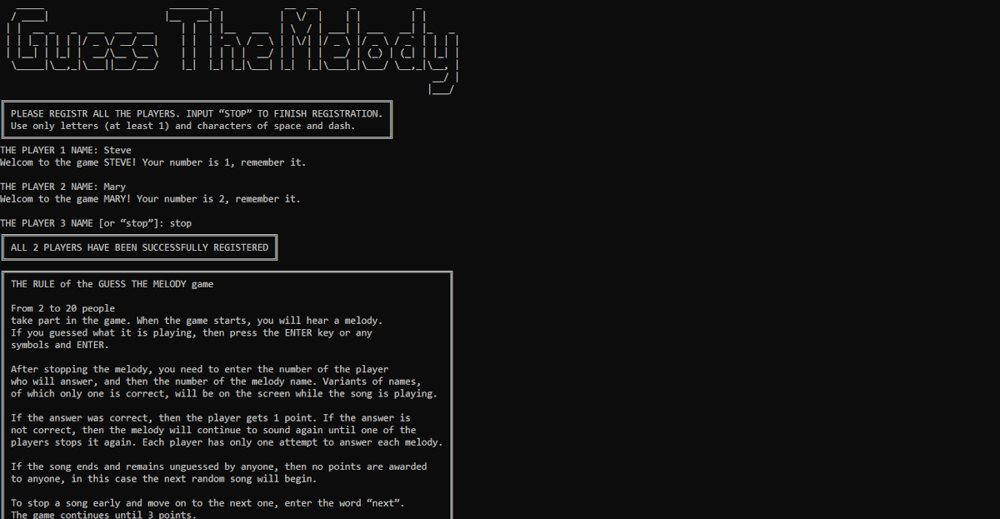

# GUESS THE MELODY
___
#### 0.0.1

### Console game

#

#### THE GAME DESCRIPTION

> From 2 to 20 people (this can be changed in the `settings.py` file)
> take part in the game. When the game starts,
> you will hear a melody. If you guessed what it is playing, then
> press the ENTER key or any symbols and ENTER.
> 
> After stopping the melody, you need to enter the number of the
> player who will answer, and then the number of the melody name.
> Variants of names, of which only one is correct, will
> be on the screen while the song is playing.
> 
> If the answer was correct, then the player gets 1 point. If
> the answer is not correct, then the melody will continue to
> sound again until one of the players stops it again. Each
> player has only one attempt to answer each melody.
> 
> If the song ends and remains unguessed by anyone, then no points
> are awarded to anyone, in this case the next random song will
> begin.
> 
> To stop a song early and move on to the next one, enter
> the word “next”. The game continues until 3 points
> (this can be changed in the `settings.py` file). To quit the
> game, enter the word “quit” at any time.
> 
> To stop the song to guess it, you can give each player access to independently
> press the ENTER key or assign a manager who will stop the song
> by any player shouting “STOP”.
> 
> *Based on the TV show of the same name.*

In its basic version, the game uses music files in **midi** format.
However, the built-in player (using the pygame module player)
can play files of other formats, for example **mp3**.

The choice to use midi files for the basic version was made for
two main reasons:
- When using MIDI files, all melodies sound in the same style.
- MIDI files take up a small amount of memory. For example, the 56 tracks used in this basic version occupy about 1.56 MB of memory.

Files for playing melodies that need to be guessed are located
in the `sound_library` folder. In the game repository there is also
an `extra_sound_library` folder, which contains empty midi files
that serve to reduce the repetition of names in the list of tracks,
which is shown as a hint. It is not necessary to use this directory
with pseudo tracks, but it is recommended if there is a small 
number of real tracks in the repository.

> The game process takes place in the system console, as this
> was one of the technical requirements of the task. However,
> this program can easily be modified for the web version,
> for example, using Django or Flask frameworks.

> Tested on Windows 10

**Make sure you turn on the speaker system before testing it yourself :)**
